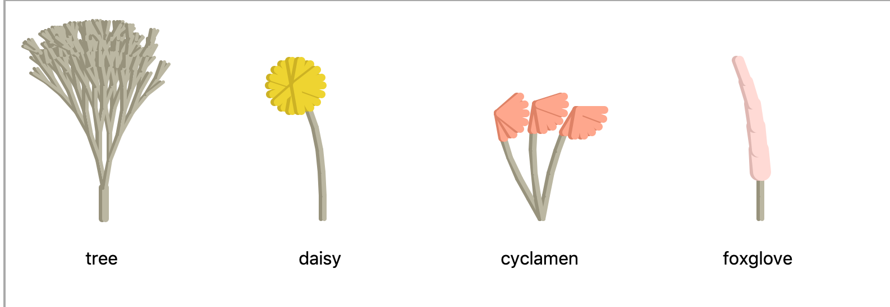
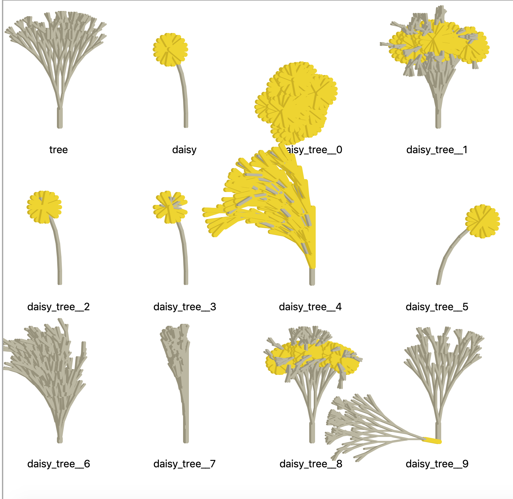
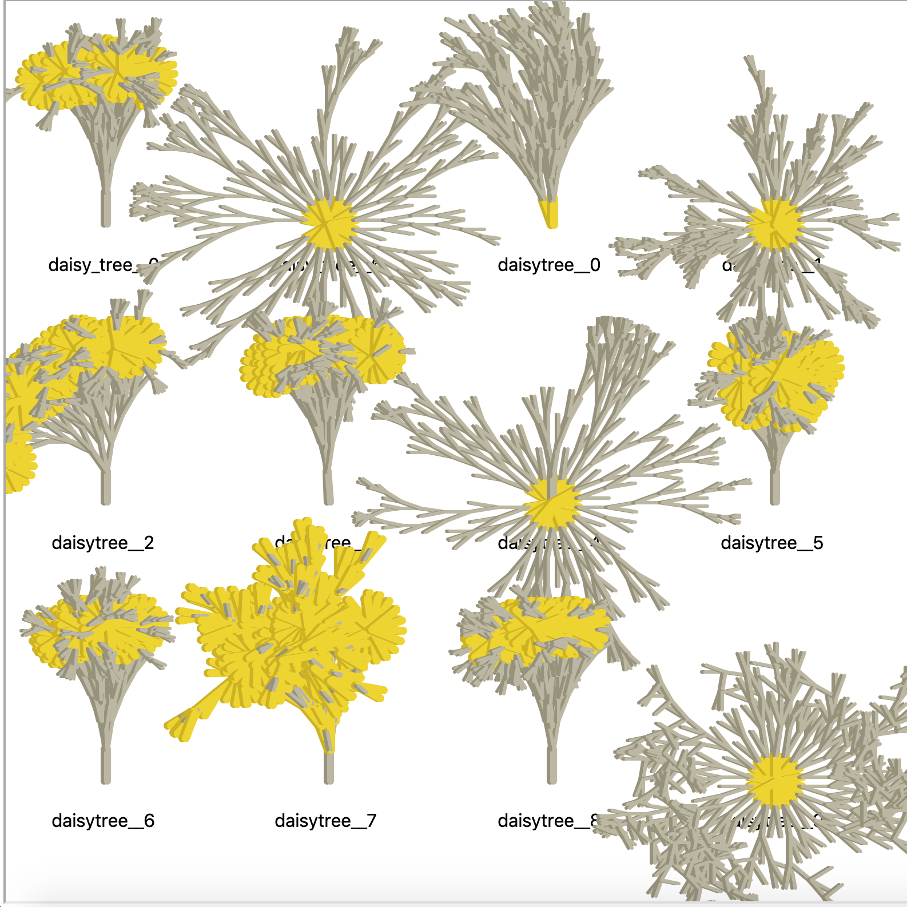
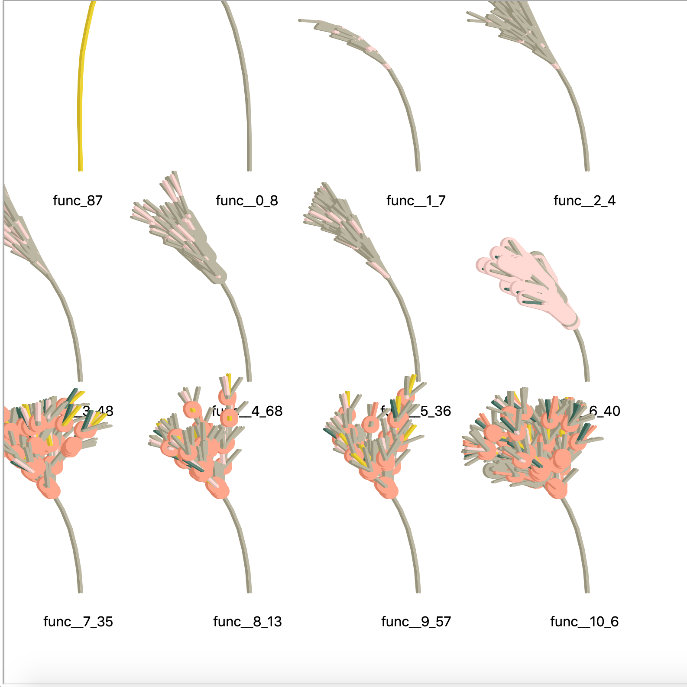
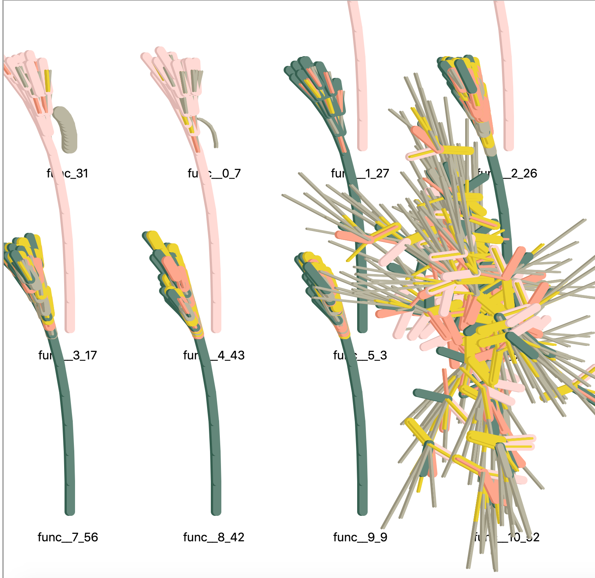

# Mutant Flowers

The Python 3.9 `ast` library provides the new `unparse` convenience function, turning an AST back into readable code. As well as making it much easier to understand the impact of changes to an AST, it also allows something that was previously very difficult: A complete round trip from a function, to an AST, and then back to a function again which can be turned into an AST once more. In other words, it's now relatively straightforward to send code through multiple generations of changes using just the `ast` library. That gave me an idea. An extremely stupid idea.

## Basic Flowers

I started by writing a few very simple functions for drawing flowers. 



The drawing itself is handled by some other code, using the `turtle` library. The functions just take a generation number as an input, and return an output that gets interpreted by the drawing library. Here's an example, the function which draws the daisy in the image above.

```python
def daisy(gen, forward=40, turn=0, width=4, colour=0):
    output = []
    if gen <= 5:
        output.append((forward - 20, turn + gen * 2, width, colour + 0))
    elif gen == 6:
        for i in range(18):
            output.append((forward - 15, turn + i * 20, width + 3, colour + 3))
    return output
```


Pretty simple! Let's have a look at that function as an AST.

<details>
  <summary>Click here to expand. Warning! It's long!</summary>

```python
FunctionDef(
    name='daisy',
    args=arguments(
        posonlyargs=[],
        args=[
            arg(arg='gen'),
            arg(arg='forward'),
            arg(arg='turn'),
            arg(arg='width'),
            arg(arg='colour')],
        kwonlyargs=[],
        kw_defaults=[],
        defaults=[
            Constant(value=40),
            Constant(value=0),
            Constant(value=4),
            Constant(value=0)]),
    body=[
        Assign(
            targets=[
                Name(id='output', ctx=Store())],
            value=List(elts=[], ctx=Load())),
        If(
            test=Compare(
                left=Name(id='gen', ctx=Load()),
                ops=[
                    LtE()],
                comparators=[
                    Constant(value=5)]),
            body=[
                Expr(
                    value=Call(
                        func=Attribute(
                            value=Name(id='output', ctx=Load()),
                            attr='append',
                            ctx=Load()),
                        args=[
                            Tuple(
                                elts=[
                                    BinOp(
                                        left=Name(id='forward', ctx=Load()),
                                        op=Sub(),
                                        right=Constant(value=20)),
                                    BinOp(
                                        left=Name(id='turn', ctx=Load()),
                                        op=Add(),
                                        right=BinOp(
                                            left=Name(id='gen', ctx=Load()),
                                            op=Mult(),
                                            right=Constant(value=2))),
                                    Name(id='width', ctx=Load()),
                                    BinOp(
                                        left=Name(id='colour', ctx=Load()),
                                        op=Add(),
                                        right=Constant(value=0))],
                                ctx=Load())],
                        keywords=[]))],
            orelse=[
                If(
                    test=Compare(
                        left=Name(id='gen', ctx=Load()),
                        ops=[
                            Eq()],
                        comparators=[
                            Constant(value=6)]),
                    body=[
                        For(
                            target=Name(id='i', ctx=Store()),
                            iter=Call(
                                func=Name(id='range', ctx=Load()),
                                args=[
                                    Constant(value=18)],
                                keywords=[]),
                            body=[
                                Expr(
                                    value=Call(
                                        func=Attribute(
                                            value=Name(id='output', ctx=Load()),
                                            attr='append',
                                            ctx=Load()),
                                        args=[
                                            Tuple(
                                                elts=[
                                                    BinOp(
                                                        left=Name(id='forward', ctx=Load()),
                                                        op=Sub(),
                                                        right=Constant(value=15)),
                                                    BinOp(
                                                        left=Name(id='turn', ctx=Load()),
                                                        op=Add(),
                                                        right=BinOp(
                                                            left=Name(id='i', ctx=Load()),
                                                            op=Mult(),
                                                            right=Constant(value=20))),
                                                    BinOp(
                                                        left=Name(id='width', ctx=Load()),
                                                        op=Add(),
                                                        right=Constant(value=3)),
                                                    BinOp(
                                                        left=Name(id='colour', ctx=Load()),
                                                        op=Add(),
                                                        right=Constant(value=3))],
                                                ctx=Load())],
                                        keywords=[]))],
                            orelse=[])],
                    orelse=[])]),
        Return(
            value=Name(id='output', ctx=Load()))],
    decorator_list=[])
```

</details>
_____

Crazy complicated! It took a long while to figure out what was going on here, but the key insight is that it uses a tree structure. Nodes in the tree represent operations on variables or constants, or else more complex invocations of functions and comparisons. Because it's a tree, it's susceptible to more-or-less the same kinds of manipulations as used in genetic programming - mutation, cross-pollination, pruning, and so on.

## Cross Pollination

I wondered what would happen if I manipulated the syntax tree of a function, injecting nodes from another function or else mutating the nodes directly. To my surprise, the results actually drew flowers that (sometimes) looked like a cross breed of the two.



The cross breeding and mutation produce all kinds of weird effects! 

```python
def daisy_tree__1(gen, forward=40, turn=0, width=4, colour=0):
    output = []
    if gen == 0:
        output.append((forward - gen * 5, turn, 6, colour + 0))
    else:
        for i in range(2):
            if gen <= 5:
                output.append((forward - 20, turn + gen * 2, width, colour + 0))
            elif gen == 6:
                for i in range(18):
                    output.append((forward - 15, turn + i * 20, width + 3, colour + 3))
            output.append((forward - gen * 5, -10 + 20 * i, -2, colour + 0))
    return output
```

You can see here that the function has the branching structure of the `tree` function, `for i in range(2):`, but its also picked up the `daisy`'s `elif gen == 6:`. That gives its flower the appearance of a combination of the two functions.

I thought it'd be fun to be able to choose some particularly nice flowers and bring them into a second generation, seeing if it bred even better combinations of the two functions. This was a mistake, as the functions tend to create eldrich sigils which summon elder beings.



## Evolution

I was not discouraged! Taking inspiration from the [GPLearn](https://gplearn.readthedocs.io/en/stable/intro.html) library and its extremely helpful author, I had a go at instituting a procedure for "evolving" a flower. It goes something like this:

1) Create a bunch of random function "stubs", which take the right input and produce the right output, but otherwise do some more-or-less random combination of operations to build their outputs.
2) Generate outputs for these functions.
3) Test the outputs of the functions against a "fitness" function which checks how much the output looks like a flower (this was the trickiest bit, and it mostly involved a whole lot of fiddling).
4) Select a set of the fittest functions to go into a new generation (I copied `gplearn`'s "tournament" selection process).
5) Cross breed and mutate the selected functions to create a new generation of functions.

I did a bit of other stuff too, like penalising functions that got too long, and figuring out how to prune excessively long functions (TODO: Implement "hoist" mutation). 

To my vast surprise, I very quickly got something that would reliably improve the fitness of the functions in each generation. It took much longer to write a fitness function which actually produced a flower that looked halfway decent. Here's ten generations of flowers evolving towards something fairly flower-like:



The fitness function penalises anything more than a single stalk for the first four iterations, and then rewards variety in subsequent generations. Consequently, we get convergence on a single stem for the first iterations, and then chaos after that.



Successful functions tend to converge on a similar solution, but sometimes they can get pretty wild.

As you might expect, even penalising long functions, the evolution process tends to write dogshit code.

Here's an example of a typical "winning" function.

```python
def func__10_6(gen, forward=40, turn=4, width=3, colour=1):
    output = []
    if gen > 4:
        output.append((forward * colour, turn - gen, width - colour, turn + gen))
        output.append((forward % width, turn % forward, width - colour, colour / colour))
        if gen > 4:
            output.append((forward * colour, colour - forward, width * colour, colour / forward))
            output.append((forward % width, turn % forward, forward - width, colour + colour))
            output.append((forward % width, turn % forward, width - turn, colour - colour))
            if gen > 4:
                output.append((forward * colour, forward - gen, width - colour, colour / forward))
                output.append((forward - 10, turn % forward, width - colour, colour / colour))
                output.append((forward % width, turn % forward, turn - turn, colour - colour))
        output.append((forward - 10, turn + gen, forward % -4, colour * gen))
    if gen > 4:
        output.append((forward * colour, turn - gen, width - colour, colour / forward))
        if gen > 4:
            output.append((forward * colour, turn - gen, width - colour, turn + width))
            output.append((forward % width, turn % forward, width - colour, colour / colour))
            if gen > 4:
                output.append((forward * colour, turn - forward, width * colour, colour / forward))
                output.append((forward % width, turn % forward, forward - width, colour + colour))
                output.append((forward % width, turn % forward, width - turn, colour - colour))
                if gen > 4:
                    if gen > 4:
                        output.append((forward - 10, width + gen, width % 4, colour * output))
                        output.append((forward - 10, turn % forward, width - colour, colour / colour))
                        output.append((forward % width, turn % forward, width - turn, colour - colour))
                        output.append((forward % width, turn % forward, width - colour, colour / forward))
                        if gen > 4:
                            if gen > 4:
                                output.append((forward % width, turn % forward, width - colour, colour / colour))
                                if gen == 7:
                                    output.append((forward + 7, colour + turn, forward - 10, colour + turn))
                            output.append((forward % width, turn % forward, width - turn, colour - colour))
                            output.append((forward - 10, turn + gen, width % 4, colour * gen))
                            output.append((forward - 10, turn + gen, width % 4, colour * output))
                    output.append((forward * colour, turn - gen, width - colour, colour / forward))
                    output.append((forward - 10, turn % forward, width - colour, forward - width))
                    output.append((forward % width, turn % forward, turn - turn, colour - colour))
            output.append((forward - 10, turn + gen, forward % -4, colour * gen))
        output.append((forward % width, turn % forward, forward % -4, forward / colour))
        if gen > 4:
            output.append((forward * colour, turn - gen, width - colour, colour / forward))
            if gen > 4:
                output.append((forward % width, turn % forward, width - turn, colour - colour))
                if gen == 7:
                    output.append((forward + 4, width - 2, width + 2, colour + turn))
            output.append((forward % forward, turn - forward, forward % -4, forward / colour))
            output.append((forward - 10, colour + gen, forward % -4, colour * gen))
        output.append((forward - 10, turn + gen, forward % -4, colour * gen))
    if gen == 7:
        output.append((forward + 7, width - 2, width + 2, colour + turn))
    output.append((forward - 10, turn + gen, width % 4, colour * output))
    return output
```

So your job is probably safe. Evolved code isn't going to replace you any time soon. Possibly given enough generations and a large enough generation size it would eventually find a solution that's more concise, and probably I could do more to help it out. But the trouble with this whole approach is that it's extremely slow, and also janky as heck. My process only successfully runs like, one time in three, due to weird memory issues, problems with infinite recursion, and other stuff I don't really understand. Maybe I'll come back and make it more efficient, but it's very hard to debug.